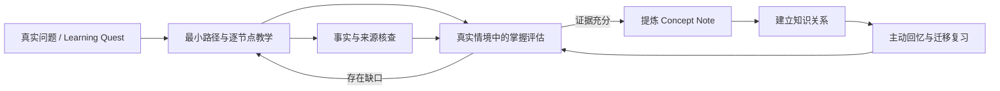

# Learning Vault Skills

面向问题驱动学习的 AI 技能集：从真实问题出发，通过证据化教学、案例评估、知识提炼、关系构建与主动复习，把“看懂了”转化为可迁移、可验证的能力。

> Problem-driven learning workflows for durable, transferable understanding.

## 为什么做这个项目

很多 AI 学习流程擅长生成解释、摘要和笔记，却没有解决几个更根本的问题：

- 得到一段流畅回答，不代表学习者已经理解。
- 收藏和整理了大量笔记，却很少重新提取或真正使用。
- 按学科目录囤积知识，容易脱离正在解决的真实问题。
- AI 一次生成完整笔记，会掩盖理解缺口，并把未经验证的内容伪装成个人知识。
- 低质量的连续追问看似互动，实际只是在要求复述常识。

这个项目不把“生成更多内容”当作目标，而是围绕一个学习闭环组织 Agent 行为：



## 核心原则

1. **问题先于学科**：从“我要解决什么”出发，只学习当前需要的最小知识依赖。
2. **理解先于笔记**：AI 输出和聊天记录不是已掌握知识；正式笔记必须有用户自己的解释和应用证据。
3. **迁移先于复述**：评估优先使用预测、诊断、权衡、设计和边界分析，而不是背定义。
4. **来源与掌握分离**：内容可靠性由 `verify` 核查，学习者是否会用由 `assess` 判断。
5. **小概念、强连接**：概念笔记保持边界清楚，通过链接组成可扩展的知识网络。
6. **人保留最终决定权**：创建、覆盖、移动或晋升正式笔记前，需要用户明确确认。

## 技能一览

| 技能 | 职责 | 不应该做什么 |
| --- | --- | --- |
| `teach` | 建立学习问题、探测现有理解、生成最小依赖路径并逐节点教学 | 展开整套学科，或把教程输出误认为掌握 |
| `assess` | 用真实案例、数据、故障和决策冲突获得掌握证据 | 复述题、审讯式反问、无休止补问 |
| `verify` | 核查事实、公式、定义、来源、适用条件与反例 | 评判学习者水平，或编造引用 |
| `distill` | 把通过解释与应用验证的理解提炼为 Concept Note 草稿 | 未验证就批量生成正式笔记 |
| `link-knowledge` | 建立前置、因果、解释、对比和应用等知识关系 | 为了图谱密度制造无意义链接 |
| `review` | 根据遗忘、历史错误和当前项目安排主动回忆与迁移任务 | 让用户重新阅读笔记，或只出选择题 |

## 一次典型学习过程

假设学习者从“如何让两轮平衡车保持直立”开始：

1. `teach` 将目标改写成可观察能力，并探测现有的控制、传感器和数学基础。
2. Agent 只展开当前必要的路径，例如姿态误差、反馈控制、PID 和离散采样，而不是先讲完整的自动控制课程。
3. `verify` 核查关键定义、公式和适用条件。
4. `assess` 给出带噪声、延迟、执行器饱和或指标冲突的情境，让学习者预测、诊断或设计方案。
5. 只有在解释与应用证据充分后，`distill` 才提议生成诸如“PID 控制器”这样的原子概念笔记。
6. `link-knowledge` 把它连接到反馈、积分饱和、低通滤波和实际项目。
7. `review` 在之后的真实问题中重新调用这些概念，而不是提醒用户重读原文。

## 高质量评估是什么

评估问题必须与目标能力相关，不能只靠复述上一段回答，并且应包含新的情境、数据、约束、异常或取舍。

低质量问题：

> 有了 eval set 和指标以后，你会怎么判断 Prompt 变好了还是变坏了？

它只能诱导学习者说出“运行评估并比较指标”。更有效的任务是提供常规任务成功率、安全边界、成本和延迟之间的冲突数据，要求学习者决定是否发布、设定红线，并设计下一项实验。

`assess` 使用四级证据判断：

- `0 无证据`：没有作答或与目标无关。
- `1 识别`：能复述或识别概念，但不能独立应用。
- `2 应用`：能在给定情境中正确使用并说明关键理由。
- `3 迁移`：能处理新约束、边界和指标冲突，并主动检查失败模式。

回答充分时应立即结束评估。同一能力最多补测一次；再次失败就返回教学，而不是继续纠缠。

## 快速开始

当前仓库采用 `SKILL.md` 技能约定，可放入支持项目级技能发现的 Agent 工作区。以当前兼容的命令行为例：

```bash
git clone https://github.com/Serral828/Learning-Vault-Skills.git .pi
pi
```

如果工作区已经有 `.pi` 配置，请只合并 `skills/`，并保留自己的设置。确认技能命令已启用后，可以从一个真实问题开始：

```text
/skill:teach 我想理解如何让两轮平衡车保持直立
```

也可以单独调用：

```text
/skill:verify 核查这个公式的适用条件和来源
/skill:assess 用一个实际案例检查我是否真的会用这个概念
/skill:distill 将已通过验证的理解整理为候选概念笔记
/skill:review 根据近期错误和当前项目安排一次复习
```

这些技能可以与 Markdown 知识库配合使用，但核心设计不依赖某个特定笔记软件：文件只是知识的持久化界面，真正的重点是学习证据与知识状态变化。

## 推荐的知识库结构

```text
01-学习问题/       真实问题、目标能力和暂时性知识路径
02-概念/           通过理解验证后的原子概念笔记
03-主题地图/       主题入口和导航，不承担知识本体
04-来源/           书籍、论文、视频与网页来源记录
05-实践与产出/     实验、项目、推导、文章和其他应用证据
90-学习会话/       原始学习过程与错误记录
99-归档/           不再活跃但仍需保留的内容
.learning/         学习者档案、掌握状态与复习队列
.pi/skills/        本仓库提供的 Agent 技能
```

文件夹表达笔记类型与生命周期，Markdown 链接表达知识之间的前置、因果、解释、对比和应用关系。

## 状态文件

技能会在存在时读取以下本地状态：

- `.learning/learner-profile.json`：有证据支持的能力、困难与交互偏好。
- `.learning/mastery-state.json`：概念掌握证据与最近验证状态。
- `.learning/review-queue.json`：需要重新提取或迁移的复习任务。

这些文件属于个人学习状态，不应因为使用本仓库而被公开。本仓库只维护可复用的技能规则。

## 安全边界

- 未经用户确认，不创建、覆盖、移动或删除正式知识笔记。
- 无可靠证据时明确标记不确定性，不伪造来源。
- 技能只定义 Agent 行为，不提供操作系统级沙箱。
- 启用具有文件写入或 Shell 权限的 Agent 模式前，应确认工作目录和授权范围。
- `.gitignore` 已排除常见认证文件与环境变量文件，但提交前仍应检查差异。

## 自定义

可以在不破坏核心边界的前提下调整：

- Learning Quest 与 Concept Note 模板。
- 掌握证据门槛和复习间隔。
- 不同领域的案例生成偏好。
- 学习者档案中的已有能力、常见困难和交互偏好。
- 知识关系类型与主题地图组织方式。

建议把个人状态和具体知识内容保留在自己的学习库中，只将可复用、经过验证的技能规则贡献回本仓库。
