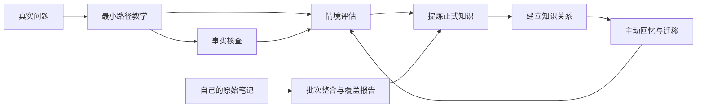

# Learning Vault Skills

面向问题驱动学习与个人知识管理的 AI 技能集：从真实问题出发，通过教学、验证、评估、知识整合、关系构建和主动复习，把“看过、记过”转化为可调用、可迁移、可验证的能力。

> Problem-driven learning and knowledge-integration workflows for durable, transferable understanding.

## 它要解决什么

很多 AI 学习流程擅长生成解释、摘要和笔记，却没有解决更根本的问题：

- 得到一段流畅回答，不代表学习者已经理解。
- 收藏了大量笔记，却很少主动提取、连接或实际使用。
- 按学科目录囤积知识，容易脱离正在解决的真实问题。
- AI 一次生成完整笔记，会掩盖理解缺口，并把未经验证的内容伪装成个人知识。
- 从视频、课程或书籍写下的系统笔记，很难自然融入已有知识网络。
- 编程教学中的示例代码需要反复复制粘贴，打断了对方法和行为的观察。
- 低质量的连续追问看似互动，实际只是在要求复述常识。

本项目围绕两个互补入口组织 Agent 行为：

1. **从问题开始学习**：建立目标、探测基础、沿最小知识路径教学，用真实情境获得掌握证据。
2. **从自己的笔记开始整合**：把用户已经写下的 Markdown 输入拆成概念、方法、主题入口和可选来源记录，并逐项追踪去向。



## 核心原则

1. **问题先于学科**：从“我要解决什么”出发，只学习当前需要的最小知识依赖。
2. **理解先于笔记**：AI 输出、聊天记录和原始输入都不自动等于已经掌握的知识。
3. **迁移先于复述**：评估优先使用预测、诊断、权衡、设计和边界分析，而不是背定义。
4. **来源与掌握分离**：内容可靠性由 `verify` 核查，学习者是否会用由 `assess` 判断。
5. **小概念、强连接**：概念笔记保持边界清楚，通过链接组成可扩展的知识网络。
6. **输入与来源分离**：`00-原始笔记/...` 是用户笔记的路径；视频、课程、书籍等才是可选来源。
7. **计划先于批量写入**：整合先展示完整计划，一次批准计划内写入，偏离计划必须重新确认。
8. **清理可恢复、永久删除独立触发**：整合只把输入移入 `.trash/`；清空回收站是单独的明确命令。

## 技能一览

| 技能 | 职责 | 不应该做什么 |
| --- | --- | --- |
| `teach` | 建立学习问题、探测现有理解、生成最小依赖路径并逐节点教学 | 展开整套学科，或把教程输出误认为掌握 |
| `assess` | 用真实案例、数据、故障和决策冲突获得掌握证据 | 复述题、审讯式反问、无休止补问 |
| `verify` | 核查事实、公式、定义、来源、适用条件与反例 | 评判学习者水平，或编造引用 |
| `distill` | 把通过解释与应用验证的理解提炼为 Concept Note 草稿 | 未验证就批量生成正式笔记 |
| `integrate-learning` | 将一篇或一组用户原始 Markdown 整合为正式知识，并报告 100% 内容去向 | 把输入路径当来源、静默覆盖、遗漏后清理输入 |
| `link-knowledge` | 建立前置、因果、解释、对比和应用等知识关系 | 为了图谱密度制造无意义链接 |
| `review` | 根据遗忘、历史错误和当前项目安排主动回忆与迁移任务 | 让用户重新阅读笔记，或只出选择题 |
| `purge-trash` | 在明确命令下永久清空 `.trash/` 的全部内容 | 自动触发、选择性猜测或删除 `.trash/` 本身 |

## 三种典型工作流

### 从真实问题学习

以“如何让两轮平衡车保持直立”为例：

1. `teach` 将目标改写成可观察能力，并探测现有的控制、传感器和数学基础。
2. Agent 只展开当前必要的路径，例如姿态误差、反馈控制、PID 和离散采样，而不是先讲完整的自动控制课程。
3. `verify` 核查关键定义、公式和适用条件。
4. `assess` 给出带噪声、延迟、执行器饱和或指标冲突的情境，让学习者预测、诊断或设计方案。
5. 只有解释与应用证据充分后，`distill` 才提议生成诸如“PID 控制器”这样的原子概念笔记。
6. `link-knowledge` 把它连接到反馈、积分饱和、低通滤波和实际项目。
7. `review` 在之后的真实问题中重新调用这些概念，而不是提醒用户重读原文。

### 整合自己从教程写下的笔记

假设用户看完“如何绘制高速 PCB”，把自己的总结写入：

```text
00-原始笔记/高速PCB/阻抗与回流路径.md
00-原始笔记/高速PCB/布局布线检查.md
```

调用：

```text
/skill:integrate-learning 00-原始笔记/高速PCB/
```

Agent 会冻结该目录下的 Markdown 清单，查找已有正式笔记，提出一次批次计划，例如：

- 新建或更新若干边界清楚的 Concept Note；
- 建立“高速 PCB”主题地图；
- 将操作性内容整理成布局布线检查清单；
- 只有原笔记明确记录视频、书籍或课程信息时才建立来源记录；
- 为每个输入内容单元标明“已整合、已保留、明确丢弃或未处理”。

用户一次批准后执行计划。写入和链接回读验证通过、覆盖率达到 100% 后，Agent 才询问是否把本批次 Markdown 移到 `.trash/`。相对目录会保留，非 Markdown 文件不会被读取或移动。

### 接收可运行教学代码

当教学需要一段可运行代码时，`teach` 不再默认贴出大段代码让用户复制，而是：

1. 在 `98-代码实验/<实验名>/` 写入完整代码、`README.md`、依赖声明和必要的 `.env.example`；
2. 使用 `.learning/tooling.json` 中的编辑器命令打开整个实验目录；
3. 把运行、修改与结果判断留给用户，不自动安装依赖或执行代码。

## 高质量评估是什么

评估问题必须与目标能力相关，并包含新的情境、数据、约束、异常或取舍。

低质量问题：

> 有了 eval set 和指标以后，你会怎么判断 Prompt 变好了还是变坏了？

它只能诱导学习者说出“运行评估并比较指标”。更有效的任务是提供常规任务成功率、安全边界、成本和延迟之间的冲突数据，要求学习者决定是否发布、设定红线，并设计下一项实验。

`assess` 使用四级证据判断：

- `0 无证据`：没有作答或与目标无关。
- `1 识别`：能复述或识别概念，但不能独立应用。
- `2 应用`：能在给定情境中正确使用并说明关键理由。
- `3 迁移`：能处理新约束、边界和指标冲突，并主动检查失败模式。

回答充分时立即结束评估。同一能力最多补测一次；再次失败就返回教学，而不是继续纠缠。

## 快速开始

当前仓库采用 `SKILL.md` 技能约定，可放入支持项目级技能发现的 Agent 工作区。以当前兼容的命令行为例：

```bash
git clone https://github.com/Serral828/Learning-Vault-Skills.git .pi
pi
```

如果工作区已经有 `.pi` 配置，请只合并 `skills/`，并保留自己的设置。确认技能命令已启用后，可以调用：

```text
/skill:teach 我想理解如何让两轮平衡车保持直立
/skill:verify 核查这个公式的适用条件和来源
/skill:assess 用一个实际案例检查我是否真的会用这个概念
/skill:distill 将已通过验证的理解整理为候选概念笔记
/skill:integrate-learning 00-原始笔记/STM32/
/skill:review 根据近期错误和当前项目安排一次复习
/skill:purge-trash
```

这些技能可以与 Markdown 知识库配合使用，但核心设计不依赖某个特定笔记软件：文件只是知识的持久化界面，重点是学习证据与知识状态变化。

## 推荐的知识库结构

```text
00-原始笔记/       用户亲自写下、等待整合的 Markdown 输入（默认隔离）
01-学习问题/       真实问题、目标能力和暂时性知识路径
02-概念/           边界清楚的原子概念笔记
03-主题地图/       主题入口和导航，不承担知识本体
04-来源/           输入明确提供的书籍、论文、视频与网页来源记录
05-实践与产出/     方法、检查清单、实验、项目、文章和应用证据
90-学习会话/       原始学习过程与错误记录
98-代码实验/       可运行教学材料（默认隔离）
99-归档/           不再活跃但仍需保留的内容
.trash/            已整合输入的可恢复暂存（默认隔离）
.learning/         学习者档案、掌握状态、复习队列与工具配置
.pi/skills/        本仓库提供的 Agent 技能
```

文件夹表达笔记类型与生命周期，Markdown 链接表达知识之间的前置、因果、解释、对比和应用关系。

### 默认隔离的含义

`00-原始笔记/`、`98-代码实验/` 和 `.trash/` 应加入 Agent 的忽略目录，不进入自动附加上下文或普通检索。它们只在用户显式调用对应技能并给出精确目标时访问。这是上下文治理，不是操作系统级权限隔离；具有完整文件权限的 Agent 仍可能在明确指令下访问它们。

## 本地状态与配置

技能会在存在时读取：

- `.learning/learner-profile.json`：有证据支持的能力、困难与交互偏好。
- `.learning/mastery-state.json`：概念掌握证据与最近验证状态。
- `.learning/review-queue.json`：需要重新提取或迁移的复习任务。
- `.learning/tooling.json`：代码实验根目录、编辑器命令和执行交接行为。
- `.pi/CONTEXT.md`：本地领域术语与工作约定。

这些内容属于个人学习状态，不应因为使用本仓库而被公开。建议通过仓库本地排除规则保留在设备上；尤其不要提交 `CONTEXT.md`、真实密钥、聊天记录或个人绝对路径配置。

## 安全边界

- 普通正式知识写入仍需用户确认；`integrate-learning` 使用一次批次计划批准，偏离计划必须重新确认。
- 没有可靠证据时明确标记不确定性，不伪造来源。
- 整合只有在回读验证和 100% 覆盖后才允许把输入移入 `.trash/`，且不覆盖同名目标。
- `purge-trash` 是不可恢复操作，只响应用户明确命令，精确校验目标并保留 `.trash/` 本身。
- 可运行代码写入 `98-代码实验/`；Agent 只负责写入并打开编辑器，不自动安装依赖或运行代码。
- 技能只定义 Agent 行为，不提供操作系统级沙箱。启用文件写入或 Shell 权限前，应确认工作目录和授权范围。
- `.gitignore` 会排除常见认证文件与环境变量文件，但提交前仍应检查差异。

## 自定义

可以在不破坏核心边界的前提下调整：

- Learning Quest 与 Concept Note 模板；
- 掌握证据门槛和复习间隔；
- 不同领域的案例生成偏好；
- 学习者档案中的已有能力、常见困难和交互偏好；
- 知识关系类型与主题地图组织方式；
- `98-代码实验/` 的编辑器命令与实验命名约定。

建议把个人状态和具体知识内容保留在自己的学习库中，只将可复用、经过验证的技能规则贡献回本仓库。
