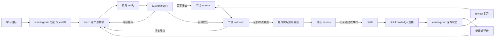

# Learning Vault Skills

一套面向 **Markdown / Obsidian 知识库** 的学习 Skills：从真实问题出发，经过教学、事实核查和情境评估，再把真正理解的内容沉淀为可连接、可复习的知识。

> 它不是“让 AI 批量替你写笔记”，而是帮助你把“看过”变成“能够解释、应用和迁移”。

## 30 秒开始使用

### 1. 放到 Vault 的 `.pi` 目录

推荐结构：

```text
你的知识库/
├── .pi/
│   ├── settings.json
│   └── skills/
├── 00-原始笔记/
├── 01-学习问题/
├── 02-概念/
├── 03-主题地图/
├── 04-来源/
├── 05-实践与产出/
├── 90-学习会话/
├── 98-代码实验/
├── 99-归档/
├── .learning/
└── .trash/
```

确保 `.pi/settings.json` 已启用 skill 命令：

```json
{
  "enableSkillCommands": true
}
```

### 2. 从 Windows PowerShell 在 Vault 根目录启动

```powershell
Set-Location -LiteralPath 'E:\Document\Vault'
pi.cmd
```

不要从 WSL 或 `.pi/` 子目录启动。Agent 进程应直接运行在 Windows 中，并以 Vault 为当前目录。项目配置会把命令工具设置为 Windows 原生 PowerShell，而不是 Bash。

### 3. 发出第一条学习请求

```text
/skill:teach 我想理解 PID 控制，并能够诊断两轮平衡车的振荡问题
```

Agent 会先确认你最终需要具备什么能力、你已经会什么，再给出当前问题所需的最小学习路径。之后 `teach` 会继续负责整个多轮学习过程：按需核查事实、评估掌握程度，并在达到门槛后提议生成正式笔记。你不需要手工逐个调用其他 skills。

## 我该调用哪个 skill？

| 你现在想做什么 | 使用命令 | Skill |
| --- | --- | --- |
| 从一个真实问题开始学习 | `/skill:teach <目标>` | `teach` |
| 查看、继续、延伸或复习某个学习项目 | `/skill:learning-hub <动作> <Quest ID>` | `learning-hub` |
| 检查自己是否真的会用 | `/skill:assess <能力>` | `assess` |
| 核查事实、公式、定义或来源 | `/skill:verify <断言>` | `verify` |
| 把已证明掌握的理解整理成正式笔记 | `/skill:distill <概念>` | `distill` |
| 整合自己已经写好的 Markdown 笔记 | `/skill:integrate-learning <相对路径>` | `integrate-learning` |
| 给现有知识建立有意义的关系 | `/skill:link-knowledge <范围>` | `link-knowledge` |
| 根据遗忘和历史错误安排复习 | `/skill:review <可选范围>` | `review` |
| 永久清空 Vault 的 `.trash/` | `/skill:purge-trash` | `purge-trash` |

`teach` 是一个 Quest 内的教学总控入口。开始时，`learning-hub` 会为新目标创建或复用稳定 Quest ID；教学过程中每个节点都只经过一次 `assess`，全部节点评估后完成实际应用输出并再做一次综合 `assess`，随后进入 `distill`。评估中的缺口会被记录，但不会触发补测或阻塞笔记整理。

表中的其他命令是独立入口，不是每次学习都必须手工执行。例如：

- 已经学过，只想直接接受一次能力测试：调用 `assess`；
- 不想进入教学，只想核查一句话或一个公式：调用 `verify`；
- 已有完整的实际应用输出和综合评估证据，只想整理笔记：调用 `distill`；
- 想主动整理一批旧笔记：调用 `integrate-learning`。

## 两条最常用的工作流

### 工作流 A：从问题开始学习

假设你想解决“两轮平衡车为什么站不稳”。

#### 第一步：建立可验证的学习目标

```text
/skill:teach 我想让两轮平衡车保持直立。我会写单片机代码，但控制理论基础较弱。
```

`teach` 会把目标转成可观察能力，并根据你的已有基础生成最小路径，例如：

```text
姿态误差 → 反馈控制 → PID → 离散采样 → 执行器饱和
```

它一次只推进一个必要节点。关键公式或事实需要可靠依据时，`teach` 会按需转入 `verify`，例如核查“积分项能够消除稳态误差”的成立条件。通常不需要你另发 `/skill:verify`。

#### 第二步：用新情境检查是否掌握

每个规划出的教学节点都有完成标准。讲解和示例结束后，`teach` 不会立刻出评估题，而会主动询问：“这一节点还有哪里需要解释？如果没有，是否现在进入评估？”你可以继续追问原理、例子、边界或与其他概念的区别；Agent 回答后会再次询问，而不是自动进入评估。只有你确认开始评估后，下一条消息才出题。

疑问不会被当作错误答案或掌握缺口，也不会出现“先答题再解释”。如果你已经在自然对话中主动完成了等价的新情境应用，`assess` 可以直接评价这段回答，不重复出题。

节点中的重要疑问和最终解答会保存为 `clarificationInsights`。Distill 生成笔记时必须逐条处理：机制解释融入正文，区别和限制进入边界与常见误区，新增加的代码或工程例子进入对应机制段，关系问题转成有理由的 Wikilink；不会单独堆成聊天式问答记录。

如果没有疑问且不想接受评估，直接说“可以通过”“可以了”“我懂了”“下一步”“继续”或类似表达即可。Agent 会立刻把当前节点评为通过，不再出题、追问或记录缺口；在综合评估中这样说，则直接进入 Distill。

证据等级为：

| 等级 | 含义 |
| --- | --- |
| `0 无证据` | 没有作答，或回答与目标无关 |
| `1 识别` | 能识别或复述，但不能独立应用 |
| `2 应用` | 能在给定情境中正确使用并说明理由 |
| `3 迁移` | 能处理新约束、边界和失败模式 |

#### 第三步：完成实际应用输出和综合评估

所有必需节点分别完成一次评估后，`teach` 不会立即生成笔记。你需要完成一个联合使用这些节点的实际成果，例如可运行控制程序、硬件诊断方案、完整演算、实验设计或带约束的决策分析。已有真实项目能够覆盖完成标准时，可以直接作为输出，不需要重复造练习。

输出完成后，`teach` 再调用一次 `assess` 做综合评估。这次不会简单汇总节点分数，而会检查成果是否真正连接多个节点、关键决策能否解释、条件改变后能否诊断，并记录为 `passed` 或 `completed_with_gaps`。评估到此结束，不再补测。

#### 第四步：把已掌握内容沉淀为正式知识

综合评估完成后，`teach` 会在正常收束前主动转入 `distill`，提议把准确知识整理成候选笔记。掌握缺口继续留在学习状态中，不会因为生成笔记而被标记为已掌握；你也不需要另发一次 `/skill:distill`。

`distill` 会先查重，再展示目标路径和完整草稿。你确认后才会写入 `02-概念/`；“自动编排”不等于未经确认自动写文件。

新概念晋升后，Agent 可以继续使用 `link-knowledge` 提议把它连接到 PID、执行器饱和和抗积分饱和方案，修改链接前仍会征求确认。到达本次检查点后，`learning-hub` 会保存状态并给出稳定 ID，例如：

```text
学习项目：两轮平衡车反馈控制
Quest ID：LQ-20260829-A7F2
状态：paused
当前位置：已完成“积分饱和”

以后可执行：
1. 继续当前路径
   /skill:learning-hub continue LQ-20260829-A7F2
2. 复习已掌握内容
   /skill:learning-hub review LQ-20260829-A7F2

现在不需要选择，状态已经保存。
```

完整循环是：



### 工作流 B：整合自己已经写好的笔记

假设你看完课程后，把自己的总结放在：

```text
00-原始笔记/高速PCB/阻抗与回流路径.md
00-原始笔记/高速PCB/布局布线检查.md
```

调用：

```text
/skill:integrate-learning 00-原始笔记/高速PCB/
```

`integrate-learning` 会：

1. 冻结本批次 Markdown 输入清单，避免执行中悄悄扩大范围；
2. 把内容拆成概念、方法、主题入口、来源信息、例子和待验证判断；
3. 检索已有正式知识，避免同义重复；
4. 展示一次完整整合计划；
5. 在你批准后执行计划内的创建和更新；
6. 回读所有目标并报告每个内容单元的最终去向；
7. 只有覆盖率达到 100% 后，才询问是否把本批次输入移入 `.trash/`。

你只需要对完整计划确认一次：

```text
可以，按这个计划执行
```

内容的最终状态只能是：

```text
已整合 → <目标文件>
已保留 → <精确位置>
明确丢弃 → <已接受的理由>
未处理 → <原因>
```

存在任何“未处理”项时，原始输入必须留在原位。

## 9 个 skills 分别负责什么

### `learning-hub`：学习项目与跨会话动作中心

- 为每个 Learning Quest 创建稳定 ID，同一目标跨会话复用，不重复创建；
- 保存多个 Quest 的状态、父子关系、能力证据和待办；
- 提供 `list`、`show`、`continue`、`extend`、`review`、`pause` 和 `archive`；
- 在教学检查点后给出最多两个未来动作：继续/延伸，以及复习；
- 把具体工作路由给 `teach` 或 `review`，自己不负责讲课和评估。

示例：

```text
/skill:learning-hub list
/skill:learning-hub continue LQ-20260829-A7F2
/skill:learning-hub extend LQ-20260829-A7F2
/skill:learning-hub review LQ-20260829-A7F2
```

### `teach`：教学主流程

- 将模糊愿望改写成真实问题或可观察能力；
- 读取已有学习证据，不把用户默认成零基础；
- 生成当前目标所需的最小知识路径；
- 一次教授一个可评估节点，讲解结束后由 Agent 主动询问是否还有疑问、是否进入评估；
- 需要事实核查时转入 `verify`；
- 用户明确要求开始评估时才转入 `assess`；用户继续提问时留在当前节点，用户要求下一步时直接放行；
- 全部节点评估后要求用户完成实际应用输出，再调用一次 `assess` 做综合评估；
- 综合评估完成后主动调用 `distill` 并展示候选草稿，不因评估缺口补测。

教学涉及可运行代码时，Agent 会在 `98-代码实验/` 创建完整练习工作区并打开编辑器，而不是默认让你复制大段代码。除非你明确要求，否则不会安装依赖或运行代码。

### `verify`：核查内容可靠性

回答“这个断言是否可靠、在什么条件下成立”。优先使用已有来源、官方文档、标准、原始论文和权威教材，并区分：

- 来源直接支持的内容；
- 合理推断；
- 模型自身知识；
- 尚无充分证据的部分。

`verify` 检查知识，不评判学习者。检查用户是否会用，应使用 `assess`。

### `assess`：获得能力证据

通过预测、诊断、权衡、设计、迁移和边界分析检查用户能否使用知识。问题必须包含新的情境、约束、数据、异常或反例，不能靠复述刚讲过的话过关。

同一节点只评估一次。未达到目标等级时记录缺口并继续，不换题补测、不要求当场重答；用户以后主动想巩固时再进入 `review`。

用户明确表示“可以通过”“下一步”“继续”或同义推进意图时优先于评分规则：当前节点直接记为 `validated`，综合评估直接记为 `passed`，两者都不追问、不记录缺口。

节点评估返回节点名称、目标等级、实际证据等级和 `validated` / `assessed_with_gaps` 状态。全部节点评估并完成实际应用输出后，综合评估返回 `passed` / `completed_with_gaps`、各节点证据和 `distillReady`。教师讲过的案例不是用户掌握证据，但掌握缺口不再阻止生成准确的 Concept Note。

### `distill`：晋升正式概念笔记

正式 Concept Note 必须同时满足：

1. 当前 Quest 的全部必需节点已经分别完成一次评估；
2. 用户已经完成覆盖这些节点的实际应用输出；
3. 综合评估已经执行一次；
4. 关键事实有来源，或明确标记为个人推断；
5. 笔记边界足够小，且只有一个核心命题。

缺少首次评估、实际应用输出或首次综合评估时保留在学习会话中。已经完成评估但存在缺口时仍可生成笔记，只是不把笔记伪装成用户已经掌握。

用户审阅候选稿或点击“确认写入”不属于掌握证据。系统只要求各阶段首次执行完成，不会在某次结果不理想时要求补测才能看候选 Concept Note。

每篇新晋升的 Concept Note 还会进行一次 Topic Map 路由。系统会选择最近的、可长期容纳多个概念的上位知识面，例如 `KNN` 进入“机器学习”，而不是创建“KNN 地图”。Topic Map 不是“已晋升概念”的平铺清单：系统会读取已有条目，根据该主题自然的组织轴把概念分成数据与表示、机制、模型方法、评估边界、实践应用等适合当前主题的组，并在组内按依赖顺序排列；具体分类随领域生成，不机械套用固定标题。加入新概念时也会检查旧条目是否需要移动或重排。已有合适地图时提议结构化更新；没有时必须同时展示一个带真实语义分组的最小 Topic Map 草稿并提议创建，不能只检查后不了了之。Concept Note 与地图会用双向 Wikilink 连接；你可以分别确认笔记和地图，暂时不处理地图时该动作会连同目标分组和重排摘要保存在 Learning Hub。

Learning Quest 与 Concept Note 也必须双向连接。`01-学习问题/<问题>.md` 使用“涉及概念”列出它真正使用的 `[[02-概念/<概念>|<概念>]]` 及作用；每篇相关 Concept Note 在“关系”中用“解决问题”反向链接 `[[01-学习问题/<问题>|<问题>]]`。Distill 会在同一次提案中展示两侧差异，不能只更新一侧。

新增知识还会触发一次已有 Concept Note 的增量关系审计。系统不仅检查“新笔记要链接谁”，还会检查“哪些旧笔记现在应该链接新知识”。例如新增“数据表示与特征向量”时，如果已有“K 近邻分类（KNN）”，提案会同时给新笔记增加“应用于 KNN”，并给旧 KNN 笔记增加“前置：数据表示与特征向量”。两侧关系词可以不同，但都要使用显式 Wikilink 并说明理由；只依赖 Obsidian 自动反向链接不算完成。

Concept Note 的默认结构是一篇能够独立阅读的知识说明，而不是学习过程表格：

```text
核心命题
  ↓
概念与机制（先解释是什么、为什么、怎样运作）
  ├─ 在相关步骤中嵌入实际应用案例
  └─ 从案例抽象回一般规律
  ↓
适用边界与常见误区
  ↓
Obsidian 双链关系
  ↓
参考（仅在确有可追溯资料时添加）
```

默认不会再生成独立的“我的理解”和“理解验证”章节。用户在对话中的好表达会被融入知识阐述；回答是否合格、哪里答错、能否迁移等掌握证据保存在 `.learning/` 或 `90-学习会话/`。本地实验路径或本次聊天也不会被机械地列为“来源与证据”。

应用案例也不会作为与知识点割裂的附录。它会被放进所解释的机制步骤中，展示抽象概念如何在真实材料上发生；案例结束后再抽象回一般规律。每篇解释型笔记至少包含一个与领域真实工作方式匹配的应用案例：

| 知识领域 | 合适的应用案例 |
| --- | --- |
| 软件、Web、AI、数据 | 实际代码、SQL、配置、API 请求与响应、数据样本、日志或执行轨迹，并解释输入与输出 |
| 硬件、电子、嵌入式 | 具体器件和参数、供电与负载、连接或布局约束、信号测量、故障现象和工程取舍 |
| 数学、统计 | 带具体数值的完整演算、模型假设、计算结果和参数变化 |
| 自然科学 | 实验或观察条件、变量、测量数据、预测和误差来源 |
| 商业、社会科学 | 具体决策者、目标、约束、数据、利益相关者和方案结果 |
| 人文、历史、法律 | 具体文本、史料、事件或案例事实，以及上下文和证据分析 |
| 设计、艺术 | 用户或受众、任务约束、方案或作品细节、评价和迭代依据 |

代码只是软件知识常见的实际应用载体，不是所有知识的统一模板。例如，硬件笔记不能只写“去耦电容可以降低噪声”，而应给出具体供电、负载变化、器件参数、放置位置、预期测量以及参数改变后的故障表现。构造的工程案例必须标注为假设，不能冒充真实项目。

正式笔记中的可执行代码块必须带知识解释性注释。注释需要解释关键组件为什么存在、变量和数据代表什么、代码步骤如何对应知识机制、重要参数为什么这样设置，以及输出能说明什么和不能说明什么。只写“导入库”“创建变量”“打印结果”不算知识解释。代码仍要保持正确缩进和可运行；没有实测的数值必须标记为预期或假设。JSON 等不允许注释的严格格式保持有效，并在紧邻正文中逐项解释，不能为了注释制造无效配置。

一个案例至少应让人看见：

```text
具体场景 → 实际目标 → 条件与约束 → 实施材料 → 可观察结果 → 概念映射 → 条件变化
```

关系则必须写成 Obsidian Wikilink，并说明链接理由：

```markdown
## 关系

- 前置：[[监督学习中的训练]] — 需要先理解训练数据如何影响模型。
- 解释：[[泛化与过拟合]] — 泛化差距可以作为检查过拟合的一个信号。
- 应用于：[[评估分类器：精确率与召回率取舍]] — 评估指标同样需要在未见数据上观察。
```

较长的软件实验放入 `98-代码实验/`，复杂工程案例可进入 `05-实践与产出/`；Concept Note 保留能够独立解释机制的最小应用材料，并通过 Wikilink 连接完整记录。

### `integrate-learning`：批次整合原始笔记

只处理用户明确指定的 `00-原始笔记/` 下的 Markdown 文件。它不会把输入文件本身当作知识来源，也不会在没有完整覆盖的情况下清理输入。

写入前展示计划；写入后回读验证；达到 100% 覆盖后，只能把输入可恢复地移动到 `.trash/`。

### `link-knowledge`：建立语义关系

支持的常见关系包括：

- `requires`：理解 A 需要先理解 B；
- `explains`：A 解释 B；
- `applies-to`：A 被用于 B；
- `contrasts-with`：A 与 B 在某个维度形成对比；
- `causes`：A 在明确条件下导致 B；
- `evidence-for`：A 是 B 的证据；
- `generalizes`：A 是 B 的更一般形式。

每条链接都必须使用 `[[目标笔记]]` 并用一句自然语言说明，不能只因词语相似就建立关系。存在同名笔记时使用 `[[相对路径/文件名|显示名称]]`，让 Obsidian 能够解析到正确目标。

### `review`：主动回忆与迁移

根据历史错误、上次验证时间、当前问题和实际项目，选择少量最值得复习的内容。先自由回忆，再通过变化后的真实案例重新评估。

“看到答案后觉得熟悉”不算掌握。

### `purge-trash`：永久清空回收暂存

只有以下明确请求才会触发：

```text
/skill:purge-trash
清空 .trash
```

该命令本身就是执行授权，不再二次确认。Skill 会精确验证目标、统计内容、永久删除 `.trash/` 内的全部文件和子目录，并保留 `.trash/` 目录本身。

这是不可恢复操作，不能用于选择性删除。

## 这套系统如何看待“知识”

它严格区分四件事：

```text
记录过 ≠ 内容可靠 ≠ 已经掌握 ≠ 能够迁移
```

- `00-原始笔记/` 表示用户记录过；
- `verify` 处理内容是否可靠；
- `assess` 处理用户是否会用；
- `distill` 决定是否可以进入正式知识；
- `review` 检查知识能否在时间过去后再次提取和迁移。

这也是本项目与普通“AI 摘要和笔记生成”工作流的主要区别。

## 目录分别放什么

| 目录 | 用途 |
| --- | --- |
| `00-原始笔记/` | 用户亲自写下、等待整合的 Markdown 输入 |
| `01-学习问题/` | 真实问题、完成标准和暂时性知识路径；统一使用 `quest` 标签 |
| `02-概念/` | 边界清楚、只有一个核心命题的 Concept Note |
| `03-主题地图/` | 主题入口和导航，不复制概念正文 |
| `04-来源/` | 书籍、论文、课程、视频和网页等来源记录 |
| `05-实践与产出/` | 方法、检查清单、实验记录、项目和应用证据 |
| `90-学习会话/` | 学习过程、错误、暂未晋升的理解 |
| `98-代码实验/` | 可运行教学代码和说明 |
| `99-归档/` | 不再活跃但仍需保留的内容 |
| `.trash/` | 已整合输入的可恢复暂存 |
| `.learning/` | 学习者档案、掌握状态、复习队列和工具配置 |
| `.pi/skills/` | Agent 的行为规则 |

文件夹表达内容类型和生命周期；Markdown 链接表达前置、解释、因果、对比和应用关系。

## Obsidian 图谱颜色与领域标签

Agent 新建或更新 Concept Note、来源、实践与产出等长期知识时，会在 YAML 中加入宽泛领域标签：

```yaml
tags:
  - domain/ai
```

领域标签回答“这篇知识笔记主要属于哪类知识”，不替代更细的 `topics`、Topic Map 或正文链接。Learning Quest 和 Topic Map 是结构节点，不使用领域标签；其他正式知识使用一个主领域，核心问题确实跨领域时最多两个。例如：

- “泛化与过拟合”使用 `domain/ai`，不会因为涉及概率就自动堆上 `domain/math`；
- “边缘设备上的目标检测”可以同时使用 `domain/ai` 和 `domain/hardware`；
- React、STM32、TF-IDF 等具体技术留在 `topics` 或链接中，不创建同名领域标签。

Learning Quest 统一只使用 `quest`，不再按 AI、Web、硬件等领域细分；它通过“涉及概念”连接的 Concept Note 承担领域信息：

```yaml
tags:
  - quest
```

Topic Map 统一只使用 `map`，不叠加 `domain/...`。这样图谱可以分别突出所有学习问题节点和地图节点，而它们连接的 Concept Note 继续按领域着色：

```yaml
tags:
  - map
```

Topic Map 不要求事先存在。新概念晋升时，Agent 会先复用最合适的已有地图，并把概念放入有语义的分类，而不是追加到笼统清单；若不存在，就提出创建一个宽泛、最小可用且具有真实分组的地图，并至少收录本次新笔记。地图只有一个入口也可以，后续知识增加时会重新审计分类、移动旧条目并形成更清晰的知识结构；系统不会生成虚假的占位链接。完整规则见 [Topic Map 创建与归属规范](docs/topic-map-writing.md)。

当前注册表提供 AI、软件、Web、硬件、数据、数学、自然科学、社会科学、人文、商业、设计、艺术、健康和教育等宽泛起始领域，但它不是封闭分类。以后出现不能自然归类的新学科时，Agent 会提议一个新的宽泛标签并说明边界；你可以在批准当次笔记计划时一并批准扩展注册表。系统不会使用 `domain/other` 强行兜底，也不会根据当前 Vault 内容限制未来领域。完整规则见 [领域标签注册表](docs/domain-tags.md)。

要在 Obsidian 关系图谱中显示颜色，打开 Graph view 的 **Groups**，为实际使用到的标签添加查询并选择颜色：

```text
tag:#domain/ai
tag:#domain/web
tag:#domain/hardware
tag:#quest
tag:#map
```

颜色属于 Obsidian 的 Graph Group 配置，不存储在 Markdown 标签里；本项目不会擅自修改你的 `.obsidian/` 设置。新增领域后，只需再增加对应 Group。查询语法和分组方式可参考 [Obsidian Graph view](https://obsidian.md/help/plugins/graph)、[Obsidian Search](https://obsidian.md/help/plugins/search) 与 [Obsidian Tags](https://obsidian.md/help/tags)。

## 本地状态与配置

Skills 会在存在时读取：

- `.learning/learner-profile.json`：已有能力、常见困难和交互偏好；
- `.learning/mastery-state.json`：掌握证据和最近验证状态；
- `.learning/review-queue.json`：待重新提取或迁移的内容；
- `.learning/learning-progress.json`：由 `learning-hub` 维护的 Quest ID、检查点、父子关系和动作注册表；
- `.learning/tooling.json`：代码实验目录、编辑器命令和交接行为；
- `.pi/CONTEXT.md`：本地领域术语与工作约定。

这些文件可能包含个人学习状态，不应随公共仓库发布。不要提交真实密钥、聊天记录或个人绝对路径。

## 默认隔离是什么意思

建议把以下目录排除在 Agent 的自动上下文附加和普通检索之外：

```text
00-原始笔记/
98-代码实验/
.trash/
```

只有当用户显式调用相应 skill 并给出精确目标时，Agent 才访问它们。

这是一种上下文治理策略，不是操作系统级权限隔离。具有文件权限的 Agent 仍可能在明确指令下访问这些目录。

## 写入和删除边界

| 操作 | 需要什么授权 |
| --- | --- |
| 建立 Learning Quest | 展示内容后由用户确认 |
| 写入 Concept Note | 展示路径和草稿后由用户确认 |
| 修改知识链接 | 展示关系、理由和受影响文件后确认 |
| 批次整合 | 用户一次批准完整整合计划 |
| 把已整合输入移入 `.trash/` | 100% 覆盖后，针对精确清单再次确认 |
| 永久清空 `.trash/` | 用户明确调用 `purge-trash` 即授权 |

`integrate-learning` 永不永久删除输入；永久删除是独立的 `purge-trash` 操作。

## 安装

### 新 Vault

```powershell
Set-Location -LiteralPath 'C:\path\to\your-vault'
git clone https://github.com/Serral828/Learning-Vault-Skills.git .pi
pi.cmd
```

### 已经存在 `.pi` 配置

不要直接覆盖整个 `.pi/`。只合并本仓库的 `skills/`，并把下面的配置加入现有 `settings.json`：

```json
{
  "enableSkillCommands": true,
  "defaultTools": [
    "read",
    "powershell",
    "edit",
    "write",
    "grep",
    "find",
    "ls"
  ]
}
```

然后退出当前 WSL 会话，从 Windows PowerShell 在 Vault 根目录重新运行 `pi.cmd`，使项目级 skills 和原生工具配置重新加载。

## 常见问题

### 使用 `teach` 时，需要自己依次调用其他 skills 吗？

不需要。`teach` 负责一个 Quest 内的教学编排，`learning-hub` 负责 Quest ID 和跨会话状态；它们会在同一段多轮学习过程中按需使用：

```text
verify → 核查关键事实
assess → 获得掌握证据
实际应用输出 → 联合使用全部必要节点
assess → 综合评估整个 Quest
distill → 综合评估完成后提议生成正式笔记
link-knowledge → 新笔记晋升后提议建立关系
learning-hub → 保存 Quest 状态和未来动作
```

其中评估和 Distill 不是等你事后提醒的可选收尾：每个规划节点在进入下一节点前评估一次；所有节点评估后完成实际应用输出，再进行一次综合评估；随后 `teach` 主动展示 Distill 草稿并询问是否写入。未达到目标等级只记录缺口，不补测。只有你明确表示现在必须停止时，系统才把尚未首次执行的阶段保存到 Learning Hub。

你只需要继续参与教学、回答评估任务，并在写入正式知识时确认草稿。单独调用这些 skills，是为了让你能够直接进入某个阶段，而不是完整学习流程的必需步骤。

`review` 通常发生在未来的另一次会话，`integrate-learning` 则是另一条处理已有原始笔记的独立工作流。

### 结束时没有时间处理后续建议怎么办？

确认一个需要持久化的 Learning Quest 时，可以一次性允许 `learning-hub` 自动更新该 Quest 在 `.learning/learning-progress.json` 中的非正式状态。之后 Agent 会在完成节点、获得能力证据或暂停时保存最小检查点，而不是把后续选择只留在聊天末尾。

你当下不需要从菜单中选择。下次从 Vault 根目录开始新会话后直接输入：

```text
/skill:learning-hub list
```

Agent 会列出所有未归档 Quest 的 ID、当前位置和可执行动作。选择某个 Quest 后，它会读取检查点，简要说明上次停在哪里、已经证明什么以及准备做什么。开始新的学习不会覆盖旧事项；新 Quest 只会成为当前焦点，旧 Quest 及其动作继续保留。

也可以直接指定：

```text
/skill:learning-hub continue <Quest ID 或标题>
/skill:learning-hub extend <Quest ID 或标题>
/skill:learning-hub review <Quest ID 或标题>
```

开始新学习时，Agent 只会低干扰地提醒还有多少旧 Quest 包含待办，不会强迫先处理它们；旧 Quest 也不会因为切换学习方向而自动删除。

Quest 注册表和动作是 `.learning/` 中的非正式状态，不等于 Session Log，也不等于正式知识。一次授权自动保存某个 Quest 的进度，不会授权 Agent 静默创建 Concept Note、Topic Map 或其他正式笔记。

### `/skill:...` 没有出现或无法识别

依次检查：

1. 当前启动目录是不是 Vault 根目录；
2. skills 是否位于 `<Vault>/.pi/skills/<name>/SKILL.md`；
3. `.pi/settings.json` 是否设置了 `enableSkillCommands: true`；
4. 修改配置后是否重新启动了当前 Agent 进程。

### 怎样确认 Agent 正在使用 Windows 原生 PowerShell？

在新会话中让 Agent 执行：

```powershell
$PSVersionTable.PSVersion
[System.Environment]::OSVersion
Get-Location
```

路径应显示为 `E:\Document\Vault` 一类 Windows 路径，工具名称应为 `powershell`，而不是出现 `/mnt/e/...`、`WSL_DISTRO_NAME` 或 Linux 内核版本。

### 我只是想快速问一个问题，也必须走完整流程吗？

不需要。只有当目标是形成可验证、可沉淀的理解时才使用完整学习循环。简单事实查询可以直接提问，必要时单独调用 `verify`。

### 原始笔记可以直接成为 Concept Note 吗？

不自动成为。`integrate-learning` 会先拆分、查重和决定去向。宽主题通常进入 Topic Map，操作步骤通常进入实践与产出，边界清楚的命题才适合成为 Concept Note。

### `integrate-learning` 和 `distill` 有什么区别？

- `distill` 面向当前教学过程中已经通过解释和应用验证的理解；
- `integrate-learning` 面向用户以前亲自写在 `00-原始笔记/` 中的一篇或一组 Markdown。

### 可以不使用某个特定笔记软件吗？

可以。系统只依赖普通目录、Markdown 文件和链接，不要求使用某个特定笔记软件。

## 自定义

可以根据自己的学习方式调整：

- Learning Quest 与 Concept Note 模板；
- 掌握证据门槛和复习间隔；
- 不同领域的案例生成偏好；
- 学习者档案中的能力、困难和交互偏好；
- 知识关系类型和 Topic Map 组织方式；
- `98-代码实验/` 的位置、编辑器命令和命名约定。

建议把个人知识和学习状态保留在自己的 Vault，只把可复用、经过验证的 skill 规则贡献回本仓库。

## 设计决策

- [ADR-0002：整合后的输入先进入回收暂存，再独立永久清理](docs/adr/0002-stage-integrated-input-notes-before-purge.md)
- [ADR-0003：原始输入和代码实验保留在 Vault 内，但默认隔离](docs/adr/0003-keep-isolated-working-folders-inside-vault.md)
